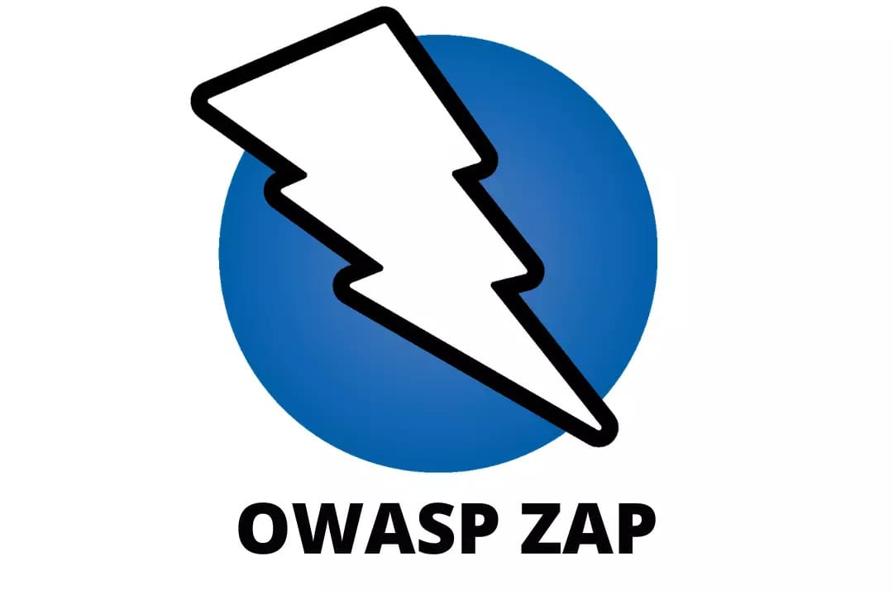
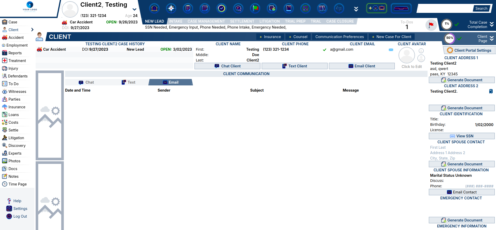
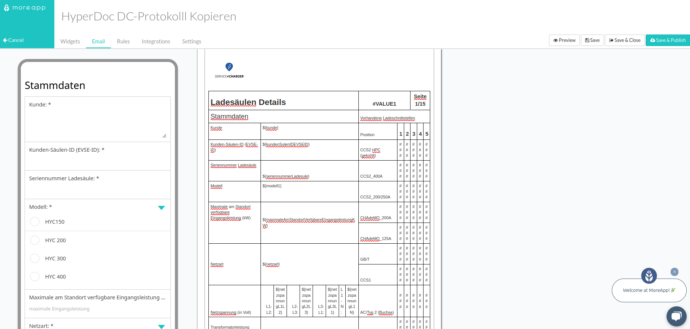

 {:style="border-radius: 50%; width: 150px; height: 150px;"}

## Moeez Ahmed
Full Stack Web Developer

Welcome to my portfolio! I am a Full Stack Web Developer with experience in both front-end and back-end development. I build scalable, responsive, and efficient websites and web applications.

Some of my key skills include:

- HTML, CSS, and JavaScript
- React.js, Node.js, and Express
- API Development and Integration
- Database Design (SQL, NoSQL)

    

 [➤ CLick To See Blogs](/blog.html)

# Featured Projects

## Project 1: ZAP Web Application

**ZAP (Zed Attack Proxy) Web Application - React Development**

I contributed to the development of a web application for [ZAP](https://www.zaproxy.org), an open-source dynamic application security testing tool under the Apache License. ZAP serves as a powerful security scanner for web applications, allowing users to manipulate traffic, including HTTPS-encrypted traffic, when used as a proxy server. It can also run in daemon mode and be controlled via a RESTful API.

For this project, I designed and developed a React-based web application that provides real-time site data, including request/response history, for security engineers. The tool helps security professionals monitor and analyze traffic in real-time, improving the efficiency of their security assessments.

My work on this project was recognized in the ZAP community newsletter (May 2024 edition), where it was highlighted for its contribution to enhancing the usability and functionality of ZAP for security professionals. You can read more about it [here](https://www.zaproxy.org/blog/2024-06-03-zap-updates-may-2024/).

  **Technologies Used:**

- JavaScript
- React.js - Redux
- Tailwind CSS

 

## Project 2: Website Fixes & Maintenance

I worked with a confidential US-based law and insurance firm to maintain and improve their website, ensuring an optimal user experience by addressing bugs, resolving crashes, and enhancing functionality.

My primary focus was on streamlining the website’s performance through strategic code cleanup and updating frameworks to ensure peak efficiency. I played a key role in identifying and resolving various technical issues, which led to a significant improvement in both site performance and user satisfaction.

In addition, I collaborated closely with the team to implement design and feature enhancements based on user feedback and industry best practices.

**Technologies Used:**

- Django
- JavaScript
- HTML5 - CSS

 

 

## Project 3: Dynamic HTML template for electrical protocol documentation

I had the opportunity to work on a project where I designed professional and dynamic HTML templates for electrical protocol documentation. The project involved creating a visually appealing and print-friendly template that seamlessly integrated with the [MoreApp](https://moreapp.com/en/) platform for data capture. I implemented dynamic data placeholders to populate key information such as customer details, measurements, and statuses.

The template featured a user-friendly checkbox system for multiple-choice inputs, and I ensured its full compatibility with PDF export tools. The design process also involved aligning with brand guidelines and leveraging an Excel reference to structure the layout and functionality. My work resulted in a reusable HTML template that was both responsive and easily integrated into the client's existing workflow.

**Technologies Used:**

- HyperDoc DC-Protokolll Kopieren - moreApp
- HTML5 - CSS

 

## Let's Connect

If you'd like to work together or just want to chat, feel free to reach out via:

- [GitHub](https://github.com/MZ-AD)
- [Email](mailto:moeez@tecvity.co)
- [Upwork](https://www.upwork.com/freelancers/~0115ba8d118f4a82da?mp_source=share)
